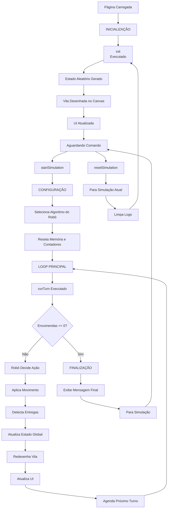
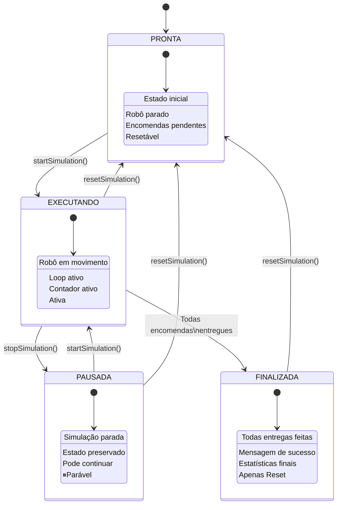

# Simulador de Entregas - Meadowfield

## O que é este Simulador?

Este projeto é uma **simulação interativa de um robô de entregas** que deve coletar e entregar encomendas em uma vila fictícia chamada Meadowfield. Baseado no capítulo "A Robot" do livro "Eloquent JavaScript", o simulador permite:

### **Funcionalidades Principais:**
- **Ambiente Virtual**: Uma vila com 11 locais conectados por estradas
- **Múltiplos Algoritmos**: Três estratégias diferentes de navegação para o robô
- **Sistema de Entregas**: Encomendas que precisam ser coletadas e entregues
- **Visualização em Tempo Real**: Mapa interativo mostrando movimentos e entregas
- **Métricas de Performance**: Contagem de passos e eficiência dos algoritmos

### **Como Funciona:**
1. O robô começa no "Post Office" com 5 encomendas aleatórias
2. Cada encomenda tem um local de origem e um destino
3. O robô deve coletar e entregar todas as encomendas
4. Diferentes algoritmos tentam resolver o problema com estratégias variadas

## Arquitetura Model-View-Controller (MVC)

O sistema é organizado seguindo o padrão **MVC**, uma arquitetura que separa responsabilidades para melhor organização e manutenção do código. Vejamos como ela funciona em nosso projeto:

### **Model (Modelo) - Os Dados e Regras**
```javascript
// Responsável pelos dados e lógica de negócios
- VillageState: Representa o estado atual da simulação
- roadGraph: Mapa de conexões entre locais
- Algoritmos dos robôs: Lógica de decisão e navegação
```
**Função**: Gerencia os dados, regras de movimento e estado das encomendas.

### **View (Visualização) - A Interface**
```javascript
// Responsável pela apresentação visual
- drawVillage(): Renderiza o mapa no canvas
- Elementos HTML: Controles, status e logs
- updateStatusUI(): Atualiza contadores na tela
```
**Função**: Mostra visualmente o que está acontecendo na simulação.

### **Controller (Controlador) - O Coordenador**
```javascript
// Responsável pela coordenação entre Model e View
- startSimulation(): Inicia a execução
- runTurn(): Gerencia cada turno da simulação
- resetSimulation(): Reinicia o estado
```
**Função**: Recebe inputs do usuário, atualiza o Model e refresha a View.

## **Como o MVC Funciona Juntos:**

```
USUÁRIO interage com a View (clica botões)
    ↓
CONTROLLER processa a ação
    ↓
CONTROLLER atualiza o MODEL (muda estado)
    ↓
MODEL executa lógica (robô se move, entrega encomendas)
    ↓
CONTROLLER pega dados atualizados do MODEL
    ↓
CONTROLLER atualiza a VIEW (redesenha tela)
    ↓
USUÁRIO vê resultado na VIEW
```

## **Vantagens do MVC neste Projeto:**

- **Organização**: Código dividido em partes lógicas
- **Manutenção**: Fácil modificar uma parte sem afetar outras
- **Flexibilidade**: Pode mudar a interface sem alterar a lógica
- **Escalabilidade**: Fácil adicionar novos algoritmos ou funcionalidades

## **Algoritmos Implementados:**

| Algoritmo | Estratégia | Complexidade |
|-----------|------------|--------------|
| **Aleatório** | Movimentos randômicos | Simples |
| **Rota Fixa** | Segue caminho predefinido | Média |
| **Inteligente** | Pathfinding otimizado | Complexa |


## Fluxograma da Simulação


### Legenda do Fluxograma

#### **Estados Principais:**
- **INICIALIZAÇÃO**: Configuração inicial do sistema
- **Aguardando Comando**: Estado de espera por interação do usuário
- **CONFIGURAÇÃO**: Preparação da simulação com algoritmo selecionado
- **LOOP PRINCIPAL**: Ciclo recursivo de execução
- **FINALIZAÇÃO**: Estado de conclusão bem-sucedida

#### **Ações do Usuário:**
- **startSimulation**: Inicia/continua a simulação
- **resetSimulation**: Reinicia completamente a simulação

#### **Processos Automáticos:**
- **Decisão do Robô**: Cálculo da próxima direção baseado no algoritmo
- **Movimento**: Aplicação da ação no estado (imutável)
- **Detecção**: Identificação de entregas realizadas
- **Renderização**: Atualização visual do canvas
- **Agendamento**: Programação do próximo ciclo

#### **Condições:**
- **Encomendas == 0?**: Verificação se todas as entregas foram concluídas


## Etapas Detalhadas

### 1. **Inicialização** (`init()`)
```javascript
Estado Inicial → Renderização → UI Atualizada
```
- Cria estado aleatório com `VillageState.random()`
- Renderiza o vilarejo inicial com `drawVillage()`
- Atualiza contadores na interface
- Exibe mensagem de "pronto" no log

### 2. **Execução** (`startSimulation()`)
```javascript
Seleção do Robô → Configuração → Primeiro Turno
```
- Identifica algoritmo selecionado pelo usuário
- Atribui a função do robô correspondente
- Reseta memória do robô e contadores
- Inicia o loop recursivo com `runTurn()`

### 3. **Loop Principal** (`runTurn()` - Recursivo)
```javascript
DECISÃO → AÇÃO → ATUALIZAÇÃO → RENDERIZAÇÃO → PRÓXIMO TURNO
```
**Cada turno executa:**

| Fase | Função | Descrição |
|------|--------|-----------|
| **Decisão** | `currentRobot()` | Robô calcula próxima direção |
| **Ação** | `state.move()` | Aplica movimento (imutável) |
| **Detecção** | Comparação de estados | Identifica entregas realizadas |
| **Atualização** | Variáveis globais | Atualiza estado, memória, contador |
| **Renderização** | `drawVillage()` | Redesenha cena no canvas |
| **UI Update** | `updateStatusUI()` | Atualiza contadores na tela |
| **Agendamento** | `setTimeout()` | Agenda próximo turno |

### 4. **Condições de Término**

```javascript
if (encomendas.length === 0) {
    // VITÓRIA!
    // Exibe mensagem final no log
    // Para a simulação
}
```

## Sistema de Renderização

### Pipeline de Desenho (`drawVillage()`)
1. **Limpeza** - `clearRect()`
2. **Estradas** - Linhas cinzas conectando locais
3. **Locais** - Círculos azuis com rótulos
4. **Encomendas** - Quadrados vermelhos empilhados
5. **Robô** - Círculo verde com "R"

## Controles do Usuário

### Botões e Ações
- **Iniciar**: Inicia/continua simulação
- **Resetar**: Para e reinicia completamente
- **Seleção**: Altera algoritmo do robô em tempo real


## Características Técnicas

- **Velocidade**: 800ms entre turnos (configurável)
- **Estado**: Imutável (sempre cria novas instâncias)
- **Logging**: Histórico reversível de ações
- **Responsivo**: Interface adaptável com Tailwind CSS

## Estados da Simulação



### Legenda dos Estados

#### **PRONTA (Estado Inicial)**
- **Situação**: Simulação carregada e parada
- **Ações disponíveis**: Start, Reset
- **Característica**: Resetável

#### **EXECUTANDO (Estado Ativo)**
- **Situação**: Loop de simulação rodando
- **Ações disponíveis**: Stop, Reset
- **Característica**: Ativa

#### **PAUSADA (Estado Interrompido)**
- **Situação**: Simulação parada temporariamente
- **Ações disponíveis**: Continue, Reset
- **Característica**: Parável

#### **FINALIZADA (Estado de Conclusão)**
- **Situação**: Todas encomendas entregues
- **Ações disponíveis**: Apenas Reset
- **Característica**: Apenas Reset

## Transições entre Estados

| De → Para | Gatilho | Condição |
|-----------|---------|----------|
| PRONTA → EXECUTANDO | `startSimulation()` | Usuário clica "Iniciar" |
| EXECUTANDO → PAUSADA | `stopSimulation()` | Usuário para ou erro |
| PAUSADA → EXECUTANDO | `startSimulation()` | Usuário continua |
| EXECUTANDO → FINALIZADA | Condição automática | Encomendas == 0 |
| QUALQUER → PRONTA | `resetSimulation()` | Usuário clica "Resetar" |